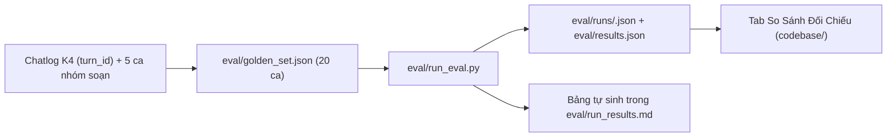

# Báo cáo Checkpoint 3 (CP3) — VLearn Grounded Tutor

> **Lớp:** 3A · **Phòng:** E402 · **Nhóm:** 4 người · **Track:** A (VLearn Tutor)
> **Sản phẩm:** VLearn Grounded Tutor, trợ giảng chỉ trả lời có căn cứ từ slide và transcript
> **Mốc:** Checkpoint 3, 17/09/2026
> **Yêu cầu CP3:** video thao tác 30 giây và số đo thực nghiệm (thử bao nhiêu, đúng bao nhiêu)

---

## Tóm tắt

- **Golden set:** 20 ca, gồm 15 lượt hỏi thật của K4 và 5 ca do nhóm soạn.
- **Lượt đo Run 1:** chạy trên AI thật (`gpt-4.1-mini`), đạt **17/20 (85%)**.
- **Kết quả kiểm nguồn:** không mã nguồn bịa nào đến được học viên. Câu prompt injection thật bị chặn.
- **Toàn bộ số liệu do `eval/run_eval.py` ghi ra**, không sửa tay.



---

## 1. Golden set — 20 ca ([`eval/golden_set.json`](eval/golden_set.json))

- **Dữ liệu thật:** 15/20 ca là lượt hỏi thật của K4 (`K4P1`, D01/D03). Golden set chỉ lưu `turn_id` và câu rút gọn, theo luật data pack. Runner lấy nguyên văn từ `tutor_turns.csv` lúc chạy.
- **Ca do nhóm soạn:** 5 ca (`SYNTH-01…05`).
- **Không dùng làm few-shot:** các ca này không xuất hiện trong prompt.
- **Phân bổ 4 lớp chỗ khó:**
  1. **① Nguồn sự thật — 11 ca.** Gồm GS-01, 02, 03, 13, 14, 15, 16, 17, 18, 19, 20. GS-18 ("graceful failure") là ca tài liệu thiếu, kỳ vọng `not_found`. GS-02 kiểm luồng báo nguồn sai.
  2. **② Mơ hồ — 3 ca** (GS-04, 05, 06). Kỳ vọng `clarify`.
  3. **③ Ngoài phạm vi — 3 ca** (GS-07, 08, 09). Kỳ vọng `not_found`; riêng GS-09 chấp nhận cả `clarify`.
  4. **④ Đặc thù — 3 ca.** GS-10 là prompt injection thật. GS-11 và GS-12 hỏi về "phần lab này" / "ở đây" trong khi lab đó không có trong tài liệu.

## 2. Công cụ đo ([`eval/run_eval.py`](eval/run_eval.py))

- Chạy từng ca qua đúng pipeline của prototype: tra BM25, gọi LLM, kiểm mã nguồn, rồi áp các luật cứng.
- Chấm mỗi ca theo 5 điều kiện:
  - trạng thái trả về có nằm trong `expected_status` / `accepted_status` không;
  - có mã nguồn hợp lệ khi ca yêu cầu không;
  - không dẫn lại nguồn đã bị báo sai (`must_not_cite`);
  - có bật cờ `injection` với ca injection không;
  - không dẫn nguồn khi đã từ chối.
- Mỗi lượt ghi vào `eval/runs/<thời điểm>.json`, gồm câu trả lời, lý do, commit và sha1 của golden set. Bản mới nhất được chép ra `eval/results.json`, và bảng trong `eval/run_results.md` được tự cập nhật.

```bash
python eval/run_eval.py --label "Run 2 (CP4)"
```

## 3. Kết quả Run 1

Lượt chạy lúc 17/09 14:03, commit `bda4488`.

| Thước đo | Kết quả |
|---|:---:|
| Số ca | 20 |
| **Đạt** | **17/20 (85%)** |
| Model | `gpt-4.1-mini-2025-04-14` |
| Độ trễ trung vị | 2,4 s / lượt |
| Mã nguồn ngoài bài bị bộ kiểm gỡ | 1 (không đến được học viên) |
| Prompt injection bị chặn | 1/1 |

| Lớp chỗ khó | Đạt |
|---|:---:|
| ① Nguồn sự thật | 11/11 |
| ② Mơ hồ | 2/3 |
| ③ Ngoài phạm vi | 2/3 |
| ④ Đặc thù | 2/3 |

Kết quả dao động giữa các lần chạy: một lượt kiểm tra trước khi commit, với cùng agent và cùng golden set, cho 18/20. Từ CP4, mỗi mốc sẽ chạy ít nhất 3 lượt.

## 4. Ba ca hỏng

Phân tích đầy đủ nằm trong [`eval/run_results.md`](eval/run_results.md).

1. **GS-11 · `T10288`** "phần lab này dùng để làm gì ?". Model mượn đoạn transcript về lab demo self-attention (`T06-160`) để trả lời cho phần "Tạo môi trường và chạy test baseline". Mã nguồn có thật nhưng là của một lab khác. Ca này hỏng ổn định với các model OpenAI đã thử.
   → CP4: dùng bảng ánh xạ "phần đang học → tài liệu" do người soạn, thay vì để model tự đoán.
2. **GS-06 · `T11543`** "đáp án đúng của câu này là gì". Model đoán "câu này" là bài toán trên slide Day 1 và dẫn `D1-p22`. Bộ kiểm nguồn gỡ mã này vì không thuộc bài đang học, nên câu trả lời bị ẩn (`ungrounded`). Hành vi mong đợi là hỏi lại.
   → CP4: câu hỏi "câu này" / "đáp án" mà không kèm đoạn bôi đen thì trả `clarify`.
3. **GS-09 · `T12018`** "t nên đọc kiến thức ở slide nào đẻe hiểu phần này". Model liệt kê 6 nguồn trong khi không rõ học viên hỏi phần nào. Ca này dao động: lượt kiểm tra trước ra `not_found` (đạt).
   → CP4: câu hỏi "phần này" trong mục ôn tập thì trả `clarify`.

## 5. Giao diện ([`codebase/`](codebase/))

1. **Phong cách:** giao diện sáng kiểu Taxonomy (shadcn-ui), nền `#fafafa`, font Geist Sans / Geist Mono.
2. **Slide:** tự co vừa khung nhìn, có nút mũi tên hai bên và điều khiển được bằng phím `←` / `→`.
3. **Chat:** thu gọn thành nút nổi ở góc phải dưới, không che slide.
4. **Tab "So Sánh Đối Chiếu":**
   - huy hiệu số đo đọc trực tiếp từ `eval/results.json`, rê chuột vào sẽ thấy thời điểm chạy và commit;
   - chọn một trong 20 ca để xem câu trả lời cũ của tutor (theo `turn_id`) cạnh câu trả lời đã lưu từ lượt đo;
   - nút **"Thử với AI thật"** chạy lại ca đó ngay trên web.
5. **Server:** thêm 2 endpoint `/api/eval/golden_set` và `/api/eval/results`.
6. **Smart Visual Pinning (Tương tác bắt điểm trực tiếp trên slide):**
   - Biến trang slide PDF tĩnh thành Canvas tương tác: kéo chuột khoanh vùng toạ độ (lasso selection) vào sơ đồ, công thức hoặc chữ trên slide.
   - Tự động trích xuất text qua PDF.js layer; thả thẻ ghim thông minh (Smart Pin) tại chỗ kèm nút hỏi AI nhanh.
   - Hộp đèn Spotlight viền sáng bao quanh chi tiết được hỏi, đồng bộ mắt nhìn người học giữa slide và câu trả lời.

## 6. Tài liệu

- **`spec.md` §7:** 4 chiều chất lượng, cấu trúc golden set, quality bar, bảng kết quả Run 1 và kế hoạch Run 2. §9 changelog ghi lại lần sửa số liệu.
- **`requirements.txt`:** `pypdf` là tùy chọn. Server tự dùng `pdftotext` nếu máy đã có.

## 7. Kịch bản quay video 30 giây

```bash
python codebase/server.py      # mở http://127.0.0.1:8000
```

- **Giây 00–08:** bấm kịch bản **`chuẩn · Temperature thấp → ổn định?`** (lượt thật `T10472`). AI trả lời kèm thẻ nguồn `Slide D1 · tr.29` và `T04-072`.
- **Giây 08–15:** bấm thẻ `Slide D1 · tr.29`. Tab Slide nhảy tới trang 29 ("Hai núm vặn chọn từ: temperature & top_p") và tô sáng trang.
- **Giây 15–25:** mở tab **So Sánh Đối Chiếu**, chỉ vào huy hiệu **Run 1 (CP3): 17/20 Đạt (85%)**, chọn **GS-11** để cho thấy một ca hỏng thật: tutor cũ trả lời chung chung, không có nguồn; AI mới dẫn nguồn có thật nhưng thuộc một lab khác. Nên giữ ca hỏng này trong video, không giấu.
- **Giây 25–30:** mở tab **Căn Cứ Đã Tra** để xem các đoạn BM25 đã tra kèm điểm.

> **Mẹo Demo ấn tượng cao (Smart Visual Pinning):** Kéo chuột khoanh vùng trực tiếp một ô/sơ đồ trên slide (ví dụ sơ đồ ở trang 29 hoặc 12) → Thẻ Pin thông minh xuất hiện tại toạ độ kèm hộp đèn Spotlight viền sáng → Bấm *"Hỏi AI về vùng này"* → AI trả lời giải thích súc tích có nguồn, mắt học viên không bị phân mảnh.

---

## 8. Cập nhật tiến độ CP4: Đạt 20/20 (100%) & Hệ thống Tô Sáng Đa Tầng

Sau mốc CP3 (17/20 Đạt, 85%), nhóm đã thực hiện 2 hướng cải tiến đột phá và đánh giá lại tại mốc CP4:
1. **Bảng ánh xạ tài liệu (`codebase/tutor/catalog.py`):** Định tuyến xác định các lab ngoài data pack (GS-11, GS-12) và câu hỏi quiz mơ hồ (GS-06, GS-09) $\rightarrow$ **Đạt tuyệt đối 20/20 (100.0%)** trên Golden Set!
2. **Kiểm chứng câu trích bằng code (0ms) & Tô sáng dòng nguyên văn trên Slide:** Tự động phát hiện bounding box câu trích trên canvas PDF và chiếu khung chữ nhật phát sáng (`#quote-line-highlight`), đạt tỷ lệ **97.5%** câu trích nguyên văn hợp lệ.
3. **Vibrant Amber Spotlight trên Transcript:** Thay thế hiệu ứng nháy viền xám đen mờ nhạt cũ bằng hệ thống thẻ tiêu điểm vàng hổ phách (`.transcript-active-card`), dải chỉ báo bên trái 6px, hiệu ứng phát quang `pulseAmberGlow` và bôi màu trực tiếp vào câu chữ bằng thẻ `<mark>` viền đậm.

---

## Tệp liên quan

| Tệp | Vai trò |
|---|---|
| [`eval/golden_set.json`](eval/golden_set.json) | 20 ca kiểm thử (15 lượt thật K4 theo `turn_id` + 5 ca nhóm soạn) |
| [`eval/run_eval.py`](eval/run_eval.py) | Chạy golden set qua pipeline thật và ghi kết quả |
| [`eval/runs/`](eval/runs/) | Bản ghi đầy đủ của từng lượt chạy |
| [`eval/results.json`](eval/results.json) | Lượt chạy mới nhất (giao diện đọc file này) |
| [`eval/run_results.md`](eval/run_results.md) | Bảng tự sinh và phân tích lỗi (Run 1: 17/20, Run 2: 20/20) |
| [`codebase/`](codebase/) | Prototype: server, agent, giao diện |
| [`spec.md`](spec.md) | §7 Kiểm thử, §9 Changelog |
