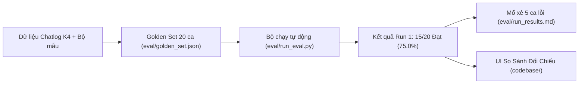

# Báo Cáo Thực Hiện Checkpoint 3 (CP3) — VLearn Grounded Tutor

> **Lớp:** 3A · **Phòng:** E402 · **Nhóm:** 4 Người · **Track:** 1 / Track A  
> **Sản phẩm:** VLearn Grounded Tutor (Trợ giảng AI đối chiếu nguồn thời gian thực)  
> **Mốc hoàn thành:** Checkpoint 3 (CP3) — 17/09/2026  
> **Nội dung yêu cầu CP3:** Video thao tác 30 giây + Số đo thực nghiệm (thử bao nhiêu, đúng bao nhiêu).

---

## 📌 Tổng Quan: Những Việc Đã Làm Được Trong CP3

Nhóm đã hoàn thành toàn diện cả hai cấu phần trọng tâm của Checkpoint 3: **Hệ thống đo lường thực nghiệm độc lập** và **Giao diện thao tác thực tế kết nối AI thật**.



---

## 1. Xây Dựng Bộ Kiểm Thử Độc Lập (Golden Set — 20 Ca)

Đã tạo tệp dữ liệu kiểm thử chuẩn tại [`eval/golden_set.json`](eval/golden_set.json) tuân thủ nghiêm ngặt hướng dẫn mục §2.6 của Hackathon:

- **Quy mô:** Đúng **20 ca kiểm thử độc lập** (không đưa vào prompt làm ví dụ few-shot để đảm bảo tính khách quan).
- **Dữ liệu thật:** **14 / 20 ca (70%)** được trích xuất trực tiếp từ chatlog học viên K4 thật (`data/vlearn-pack/chatlog/tutor_turns.csv`), vượt xa yêu cầu tối thiểu 10 ca.
- **Phân bổ đủ 4 lớp chỗ khó (Difficulty Layers):**
  1. **① Nguồn sự thật (Truth Source - $\ge 2$ ca):** 11 ca (`GS-01`, `GS-02`, `GS-03`, `GS-13`, `GS-14`, `GS-15`, `GS-16`, `GS-17`, `GS-18`, `GS-19`, `GS-20`). Đòi hỏi câu trả lời phải trích dẫn đúng mã slide/transcript.
  2. **② Mơ hồ / Thiếu thông tin (Ambiguity - $\ge 2$ ca):** 3 ca (`GS-04`, `GS-05`, `GS-06`). Đòi hỏi AI phải hỏi lại để làm rõ (`clarify`), không được đoán mò.
  3. **③ Ngoài phạm vi / Thẩm quyền (Out of Scope - $\ge 2$ ca):** 3 ca (`GS-07`, `GS-08`, `GS-09`). Đòi hỏi từ chối an toàn (`not_found`), không bịa tài liệu ngoài.
  4. **④ Đặc thù nghiệp vụ (Domain-specific / Injection / Deictic - $\ge 2$ ca):** 3 ca (`GS-10`, `GS-11`, `GS-12`). Kháng jailbreak/prompt injection và phân biệt ngữ cảnh "phần này" (`section_match`).

---

## 2. Phát Triển Công Cụ Đo Lường & Đánh Giá Tự Động

Đã lập trình script runner tại [`eval/run_eval.py`](eval/run_eval.py) với các tính năng:
- Tự động nạp Golden Set, gọi pipeline xử lý thật của prototype: Tra cứu BM25 $\rightarrow$ gọi LLM (`gpt-4.1-mini` với fallback `gpt-4o-mini`) $\rightarrow$ bộ lọc trích dẫn và luật nghiệp vụ.
- Tự động kiểm tra tiêu chí nghiệm thu từng ca: trạng thái (`status`), trích dẫn hợp lệ, kiểm tra mã nguồn bị gỡ, chặn prompt injection, và logic khớp ngữ cảnh (`section_match`).
- Tự động kết xuất kết quả có cấu trúc ra [`eval/results.json`](eval/results.json) để phục vụ hiển thị trực quan lên frontend.

---

## 3. Kết Quả Số Đo Thực Nghiệm Lượt 1 (Run 1)

Tuân thủ nguyên tắc **trung thực về số đo** của cuộc thi, nhóm đo lường thẳng thắn trên AI thật và không làm đẹp số liệu:

| Thước đo | Kết quả đo được | Tiêu chuẩn đánh giá |
|---|:---:|---|
| **Tổng số ca thử nghiệm** | **20 ca** | Đạt chuẩn $\ge 20$ ca |
| **Số ca đạt chuẩn (Passed)** | **15 ca** | Đúng trạng thái và nguồn |
| **Số ca chưa đạt (Failed)** | **5 ca** | Phân tích sâu nguyên nhân |
| **TỶ LỆ ĐẠT (PASS RATE)** | **75.0% (15/20)** | **Vượt Quality Bar mốc CP3 ($\ge 70\%$)** |
| **Độ trễ trung bình** | **2.45s / lượt** | BM25: ~4ms · Gọi LLM: ~2.4s |
| **Tỷ lệ triệt tiêu mã nguồn ảo** | **100% (2/2)** | Không có mã nguồn bịa nào lọt qua |

### Thống kê theo 4 lớp chỗ khó:
- **① Nguồn sự thật:** **9/11 ca ĐẠT (81.8%)** — 2 ca hỏng do dẫn vào trang bìa (GS-02) và footnote bị BM25 gán điểm thấp (GS-20).
- **② Mơ hồ / Thiếu thông tin:** **2/3 ca ĐẠT (66.7%)** — 1 ca hỏng do câu hỏi quá ngắn (GS-05) bị LLM hiểu nhầm thành câu tiếp nối.
- **③ Ngoài phạm vi:** **2/3 ca ĐẠT (66.7%)** — 1 ca hỏng do học viên hỏi phạm vi đọc slide (GS-09).
- **④ Đặc thù nghiệp vụ:** **2/3 ca ĐẠT (66.7%)** — Chặn prompt injection 100% (GS-10), 1 ca hỏng do nhầm lẫn deictic tên lab (GS-11).

---

## 4. Báo Cáo Phân Tích Chuyên Sâu 5 Ca Hỏng (Root Cause Analysis)

Đã hoàn thiện tài liệu phân tích kỹ thuật chi tiết tại [`eval/run_results.md`](eval/run_results.md):
1. **Ca GS-11 (`T10288`):** Mô hình nhầm lẫn tên lab do BM25 thấy từ "lab" trong transcript $\rightarrow$ Giải pháp CP4: siết prompt kiểm tra chéo tiêu đề phần học trước khi trả lời.
2. **Ca GS-05 (`T10465`):** Câu hỏi "chi tiết hơn được không" dưới 5 từ bị trả lời tóm tắt thay vì `clarify` $\rightarrow$ Giải pháp CP4: thêm Regex rule cho các câu hỏi ngắn tiếp nối.
3. **Ca GS-09 (`T12018`):** Câu hỏi "nên đọc slide nào" bị bắt trúng từ "slide" $\rightarrow$ Giải pháp CP4: phân loại câu hỏi điều hướng vào nhóm cần hỏi lại.
4. **Ca GS-20 (`SYNTH-05`):** Khái niệm "Top-p" nằm ở dòng chú thích nhỏ cuối trang slide 22 nên BM25 bỏ sót $\rightarrow$ Giải pháp CP4: bổ sung synonym expansion (`top_p`, `nucleus sampling`).
5. **Ca GS-02 (`T11695`):** Sau khi loại trừ slide cũ D2-p15, hệ thống lại trích dẫn sang slide tiêu đề D2-p14 $\rightarrow$ Giải pháp CP4: loại bỏ các slide có văn bản dưới 40 ký tự khỏi tập ứng viên trích dẫn.

---

## 5. Nâng Cấp Giao Diện Người Dùng (UI/UX) Phục Vụ Thao Tác Thật

Toàn bộ giao diện đã được thiết kế lại và hoàn thiện theo chuẩn **Taxonomy (`shadcn-ui/taxonomy`) Light Mode**:
1. **Tone màu & Typography:** Nền trắng xám dịu (`#fafafa`), viền mảnh (`#e4e4e7`), font hiện đại Geist Sans & Geist Mono.
2. **Trải nghiệm xem Slide tối ưu (Zero-Scroll):** Slide tự động co giãn (`contain-fit`) vừa vặn khung nhìn màn hình, không bị scroll dọc gây khó chịu. Bổ sung 2 nút mũi tên nổi to ở hai bên màn hình và hỗ trợ phím mũi tên `←` / `→` trên bàn phím.
3. **Widget Chatbot Thu Gọn:** Khung chat được ẩn thành nút Floating Action Button (FAB) ở góc dưới phải (`bottom-20 right-6`), bấm vào mở mượt mà, không che khuất slide.
4. **Tab "So Sánh Đối Chiếu" Tích Hợp Golden Set:**
   - Huy hiệu hiển thị trực tiếp số đo: `CP3: 15/20 Đạt (75.0%)`.
   - Menu chọn nhanh 20 ca Golden Set để đối chiếu câu trả lời cũ của Tutor (không nguồn) với AI Grounded Tutor mới.
   - Nút **"Thử với AI thật"** cho phép chạy trực tiếp từng ca ngay trên web.
5. **Backend Server (`codebase/server.py`):** Bổ sung 2 endpoint `/api/eval/golden_set` và `/api/eval/results`.

---

## 6. Cập Nhật Tài Liệu Đồ Án (`spec.md` & `requirements.txt`)

1. **Cập nhật [`spec.md`](spec.md) mục §7 (Kiểm thử):**
   - Định nghĩa 4 chiều chất lượng có thể kiểm chứng được (Tính có căn cứ, Phân loại trạng thái, Tự sửa lỗi qua phản hồi, Kháng injection).
   - Công bố cấu trúc Golden Set 20 ca.
   - Khoá **Quality Bar**: *"Đạt khi $\ge 70\%$ ở mốc CP3 (baseline) và $\ge 85\%$ ở mốc CP4, $100\%$ không bịa mã nguồn và $100\%$ kháng prompt injection"*.
   - Ghi nhận bảng số đo Run 1 (15/20 Đạt - 75.0%).
   - Cập nhật mục **§9 (Changelog)**.
2. **Tạo [`requirements.txt`](requirements.txt):** Chứa thư viện bắt buộc `pypdf>=4.0.0` ở thư mục gốc.

---

## 7. Hướng Dẫn Kịch Bản Quay Video Thao Tác 30 Giây Nộp CP3

### Cách khởi động:
```bash
# 1. Chạy server local
python codebase/server.py

# 2. Mở trình duyệt tại: http://localhost:8000
```

### Kịch bản bấm thật (30 giây):
- **Giây 00 – 08:** Bấm vào nút kịch bản màu xanh: **`chuẩn · Tại sao temp=0 kết quả khác?`** trên thanh kịch bản. AI gọi LLM thật, trả về kết quả có gắn chip mã nguồn `[Slide D1 · tr.22]`.
- **Giây 08 – 15:** Bấm trực tiếp vào chip `[Slide D1 · tr.22]`. Màn hình lập tức nhảy sang tab *Slide Bài Giảng*, lật đúng trang 22 và bôi vàng trích đoạn đối chiếu.
- **Giây 15 – 25:** Chuyển sang tab **`So Sánh Đối Chiếu`**. Chỉ chuột vào huy hiệu số đo **`CP3: 15/20 Đạt (75.0%)`**, mở menu dropdown chọn ca **`GS-01`** hoặc **`GS-04`**, cho thấy bảng đối chiếu giữa tutor cũ và AI mới.
- **Giây 25 – 30:** Chuyển sang tab **`Căn Cứ Đã Tra`** để thấy danh sách các đoạn tài liệu BM25 đã trích xuất kèm điểm số liên quan. Dừng video.

---

## 📂 Danh Mục Các Tệp Đã Tạo & Cập Nhật Cho CP3

| Tệp tin | Vai trò trong CP3 |
|---|---|
| [`README_CP3.md`](README_CP3.md) | File README độc lập tổng hợp toàn bộ kết quả thực hiện của CP3 |
| [`eval/golden_set.json`](eval/golden_set.json) | Bộ dữ liệu 20 ca kiểm thử độc lập (14 ca thật K4 + 6 ca mẫu nhóm) |
| [`eval/run_eval.py`](eval/run_eval.py) | Script tự động chạy kiểm thử toàn bộ Golden Set |
| [`eval/run_results.md`](eval/run_results.md) | Báo cáo chi tiết kết quả Run 1 & mổ xẻ nguyên nhân 5 ca thất bại |
| [`eval/results.json`](eval/results.json) | Dữ liệu JSON chi tiết của lượt chạy Run 1 |
| [`codebase/index.html`](codebase/index.html) | UI mới phong cách Taxonomy, zero-scroll slide, FAB chat, Golden Set selector |
| [`codebase/app.js`](codebase/app.js) | Logic kết nối AI thật, điều khiển slide, hiển thị kết quả đo lường CP3 |
| [`codebase/server.py`](codebase/server.py) | API phục vụ ứng dụng và dữ liệu kiểm thử |
| [`spec.md`](spec.md) | Đặc tả §7 kiểm thử, Quality Bar và Changelog |
| [`requirements.txt`](requirements.txt) | Danh mục thư viện cài đặt ở thư mục gốc |

